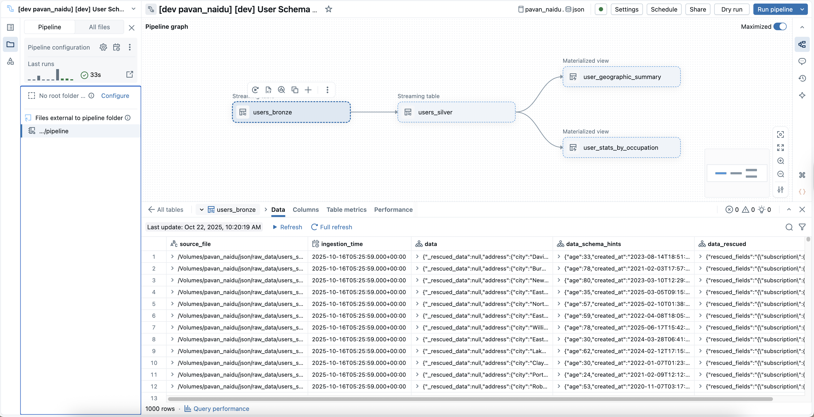

# How to Run

This guide walks you through demonstrating automatic schema evolution in Databricks Spark Declarative Pipelines.

## Overview

You'll generate fake user data in 3 phases with evolving schemas, and watch the pipeline automatically handle new fields:

- **Phase 1**: Basic user data (300 records)
- **Phase 2**: Adds `social_media` fields (300 records)  
- **Phase 3**: Adds `subscription` and `metrics` fields (400 records)



## Step-by-Step Instructions

### Step 1: Generate Phase 1 Data (Basic Schema)

Open `faker.ipynb` and run **ONLY these cells**:

1. **Cell 1**: Install dependencies (`%pip install faker`)
2. **Cell 2**: Initialize Spark session and configuration
3. **Cell 3**: Setup volume and folder
4. **Cell 4**: Generate and save Phase 1 data

**What you get**: 300 records with basic schema (user info, profile, address, preferences)

---

### Step 2: Deploy and Start the Pipeline

1. Deploy the pipeline using Databricks Asset Bundle
2. In the Databricks workspace, navigate to your deployed pipeline
3. Click **"Run pipeline"** and select **"Continuous"** mode
4. The pipeline will:
   - Start reading Phase 1 data
   - Automatically infer the schema
   - Create `users_bronze`, `users_silver`, and gold tables
   - Wait for new data...

---

### Step 3: Generate Phase 2 Data (Add Social Media)

While the pipeline is running, go back to `faker.ipynb`:

1. Run **Cell 6**: Generate and save Phase 2 data

**What happens**: 
- 300 new records arrive with a NEW field: `social_media {twitter, linkedin, github}`
- The pipeline detects the new field automatically

---

### Step 4: Generate Phase 3 Data (Add Subscription & Metrics)

Continue in `faker.ipynb`:

1. Run **Cell 7**: Generate and save Phase 3 data

**What happens**:
- 400 new records arrive with TWO MORE new fields: `subscription` and `metrics`
- The pipeline continues processing without breaking

---

## What to Observe in `users_bronze` Table

The `users_bronze()` function in `pipeline.ipynb` creates **3 columns** to demonstrate different schema evolution strategies:

### 1. `data` column - Standard Evolution (addNewColumns)
```python
from_json(col("value"), None, {
    "schemaLocationKey": "users_bronze_json",
    "schemaEvolutionMode": "addNewColumns"
})
```
**Behavior**:
- **Phase 1**: Contains basic fields (user_id, name, email, profile, address, preferences)
- **Phase 2**: Automatically adds `social_media` field to the struct
- **Phase 3**: Automatically adds `subscription` and `metrics` fields
- ✅ **Result**: All fields visible in the data struct, schema evolves seamlessly

---

### 2. `data_schema_hints` column - Guided Type Inference
```python
from_json(col("value"), None, {
    "schemaLocationKey": "users_bronze_schema_hints",
    "schemaEvolutionMode": "addNewColumns",
    "schemaHints": "age INT, created_at TIMESTAMP"
})
```
**Behavior**:
- Same as `data` column, but with explicit type hints
- ✅ **Result**: `age` stored as INT (not BIGINT), `created_at` as TIMESTAMP (not STRING)

---

### 3. `data_rescued` column - Rescue Mode (Strict Schema)
```python
from_json(col("value"), None, {
    "schemaLocationKey": "users_bronze_rescue",
    "schemaEvolutionMode": "rescue",
    "rescuedDataColumn": "rescued_fields"
})
```
**Behavior**:
- **Phase 1**: All fields in main struct, `rescued_fields` is empty
- **Phase 2**: Only Phase 1 fields in struct, NEW `social_media` → `rescued_fields`
- **Phase 3**: Only Phase 1 fields in struct, NEW `subscription` & `metrics` → `rescued_fields`
- ✅ **Result**: Schema stays fixed, new fields isolated for review before integration

---

### Other Schema Evolution Modes (Not Demonstrated)

Two additional modes are available but not shown in this demo:

**`failOnNewColumns`** - Pipeline fails when new fields appear
- Use when you need strict data contracts
- Prevents unexpected schema changes in production
- Forces explicit schema updates before accepting new fields

**`none`** - Silently ignores new fields
- New fields are dropped and not stored anywhere
- Use when you only care about specific known fields
- Helps avoid storage costs for unwanted data

---

## Cleanup

To reset and run the demo again:

1. Run **Cell 9** in `faker.ipynb` to delete all generated data
2. Stop the pipeline in Databricks
3. Drop the tables:
   ```sql
   DROP TABLE IF EXISTS users_bronze;
   DROP TABLE IF EXISTS users_silver;
   DROP TABLE IF EXISTS user_stats_by_occupation;
   DROP TABLE IF EXISTS user_geographic_summary;
   ```
4. Destroy the bundle
5. Start from Step 1 again

---

## Key Takeaways

- No manual schema definition needed - everything is inferred automatically
- New fields appear seamlessly as data evolves
- Four schema evolution modes available:
  - **addNewColumns**: Automatically add new fields (flexible)
  - **rescue**: Isolate new fields for review (controlled)
  - **failOnNewColumns**: Reject data with new fields (strict)
  - **none**: Silently drop new fields (no evolution)

